# ER Diagram — Eventify

## Overview

This ER diagram illustrates the database schema for the Eventify platform, showing all tables, their relationships, and the constraints that ensure data integrity for the event booking system.

---

## Main ER Diagram

```mermaid
erDiagram
    %% User Management Tables
    users {
        uuid id PK
        varchar email UK
        varchar password_hash
        varchar first_name
        varchar last_name
        varchar phone
        enum role
        boolean email_verified
        timestamp created_at
        timestamp updated_at
        timestamp last_login
        boolean is_active
        text preferences
    }

    user_profiles {
        uuid id PK
        uuid user_id FK
        varchar avatar_url
        date date_of_birth
        varchar gender
        text address
        varchar city
        varchar country
        varchar postal_code
        text bio
        timestamp created_at
        timestamp updated_at
    }

    %% Event Management Tables
    events {
        uuid id PK
        uuid organizer_id FK
        uuid venue_id FK
        varchar title
        text description
        varchar category
        timestamp start_time
        timestamp end_time
        enum status
        decimal base_price
        integer max_attendees
        text image_url
        text terms_and_conditions
        timestamp created_at
        timestamp updated_at
        timestamp approved_at
        uuid approved_by FK
    }

    venues {
        uuid id PK
        varchar name
        text address
        varchar city
        varchar country
        varchar postal_code
        decimal latitude
        decimal longitude
        integer total_capacity
        text description
        text contact_info
        text amenities
        timestamp created_at
        timestamp updated_at
    }

    venue_layouts {
        uuid id PK
        uuid venue_id FK
        varchar layout_name
        json layout_data
        integer total_seats
        timestamp created_at
        timestamp updated_at
    }

    %% Seating Management Tables
    seats {
        uuid id PK
        uuid venue_id FK
        uuid layout_id FK
        varchar seat_number
        varchar row
        varchar section
        enum seat_type
        decimal price_multiplier
        boolean is_accessible
        json seat_metadata
        timestamp created_at
        timestamp updated_at
    }

    seat_locks {
        uuid id PK
        uuid seat_id FK
        uuid user_id FK
        uuid booking_id FK
        timestamp locked_at
        timestamp expires_at
        enum status
        timestamp created_at
    }

    %% Ticket Management Tables
    ticket_types {
        uuid id PK
        uuid event_id FK
        varchar name
        text description
        decimal price
        integer quantity_available
        integer quantity_sold
        integer max_per_user
        boolean is_active
        date sale_start_date
        date sale_end_date
        timestamp created_at
        timestamp updated_at
    }

    tickets {
        uuid id PK
        uuid ticket_type_id FK
        uuid booking_id FK
        uuid seat_id FK
        varchar ticket_code UK
        varchar qr_code
        boolean is_scanned
        timestamp scanned_at
        timestamp created_at
        timestamp updated_at
    }

    %% Booking Management Tables
    bookings {
        uuid id PK
        uuid user_id FK
        uuid event_id FK
        uuid payment_id FK
        varchar booking_reference UK
        decimal total_amount
        decimal discount_amount
        decimal final_amount
        enum status
        integer quantity
        text special_requests
        timestamp booking_time
        timestamp expires_at
        timestamp confirmed_at
        timestamp cancelled_at
        text cancellation_reason
        timestamp created_at
        timestamp updated_at
    }

    booking_seats {
        uuid id PK
        uuid booking_id FK
        uuid seat_id FK
        uuid ticket_type_id FK
        decimal price_at_booking
        timestamp created_at
    }

    %% Payment Management Tables
    payments {
        uuid id PK
        uuid booking_id FK
        decimal amount
        enum payment_method
        enum status
        varchar transaction_id UK
        varchar gateway_transaction_id
        json payment_details
        text failure_reason
        timestamp processed_at
        timestamp refunded_at
        decimal refund_amount
        timestamp created_at
        timestamp updated_at
    }

    payment_refunds {
        uuid id PK
        uuid payment_id FK
        decimal refund_amount
        varchar refund_transaction_id
        text refund_reason
        enum status
        timestamp processed_at
        timestamp created_at
        timestamp updated_at
    }

    %% Notification Management Tables
    notifications {
        uuid id PK
        uuid user_id FK
        enum type
        varchar title
        text message
        json metadata
        enum status
        varchar email_address
        varchar phone_number
        timestamp sent_at
        timestamp read_at
        timestamp created_at
        timestamp updated_at
    }

    notification_templates {
        uuid id PK
        varchar name UK
        varchar type
        varchar subject
        text html_template
        text text_template
        json default_metadata
        boolean is_active
        timestamp created_at
        timestamp updated_at
    }

    %% Analytics and Reporting Tables
    event_analytics {
        uuid id PK
        uuid event_id FK
        date analytics_date
        integer views
        integer unique_visitors
        integer bookings_initiated
        integer bookings_completed
        decimal revenue
        decimal average_ticket_price
        integer tickets_sold
        timestamp created_at
        timestamp updated_at
    }

    user_analytics {
        uuid id PK
        uuid user_id FK
        date analytics_date
        integer events_viewed
        integer bookings_initiated
        integer bookings_completed
        decimal total_spent
        integer login_count
        timestamp last_activity
        timestamp created_at
        timestamp updated_at
    }

    %% System Management Tables
    audit_logs {
        uuid id PK
        uuid user_id FK
        varchar action
        varchar table_name
        uuid record_id
        json old_values
        json new_values
        varchar ip_address
        varchar user_agent
        timestamp created_at
    }

    system_settings {
        uuid id PK
        varchar key UK
        text value
        text description
        enum data_type
        boolean is_public
        timestamp created_at
        timestamp updated_at
    }

    %% Relationships
    users ||--o{ user_profiles : has
    users ||--o{ events : organizes
    users ||--o{ bookings : makes
    users ||--o{ seat_locks : creates
    users ||--o{ notifications : receives
    users ||--o{ audit_logs : generates
    users ||--o{ user_analytics : tracks
    
    events ||--o{ ticket_types : has
    events ||--o{ bookings : receives
    events ||--o{ event_analytics : generates
    events }o--|| venues : located_at
    events }o--|| users : approved_by
    
    venues ||--o{ venue_layouts : has
    venues ||--o{ seats : contains
    venues ||--o{ events : hosts
    
    venue_layouts ||--o{ seats : defines
    venue_layouts }o--|| venues : belongs_to
    
    seats ||--o{ seat_locks : can_be_locked
    seats ||--o{ booking_seats : booked_in
    seats ||--o{ tickets : assigned_to
    seats }o--|| venues : belongs_to
    seats }o--|| venue_layouts : part_of
    
    ticket_types ||--o{ tickets : creates
    ticket_types ||--o{ booking_seats : used_in
    ticket_types }o--|| events : belongs_to
    
    bookings ||--o{ booking_seats : contains
    bookings ||--o{ tickets : generates
    bookings ||--o{ payments : has
    bookings }o--|| users : made_by
    bookings }o--|| events : for
    bookings }o--|| payments : paid_by
    
    payments ||--o{ payment_refunds : may_have
    payments }o--|| bookings : pays_for
    
    notifications }o--|| users : sent_to
    
    event_analytics }o--|| events : tracks
    user_analytics }o--|| users : tracks
```



---

## Table Definitions and Constraints

### **users** - User Management
| Column | Type | Constraints | Description |
|--------|------|-------------|-------------|
| id | UUID | PRIMARY KEY | Unique user identifier |
| email | VARCHAR(255) | UNIQUE, NOT NULL | User email address |
| password_hash | VARCHAR(255) | NOT NULL | Bcrypt hashed password |
| first_name | VARCHAR(100) | NOT NULL | User first name |
| last_name | VARCHAR(100) | NOT NULL | User last name |
| phone | VARCHAR(20) | | Phone number |
| role | ENUM | NOT NULL | ATTENDEE, ORGANIZER, ADMIN |
| email_verified | BOOLEAN | DEFAULT FALSE | Email verification status |
| created_at | TIMESTAMP | DEFAULT NOW() | Account creation time |
| updated_at | TIMESTAMP | DEFAULT NOW() | Last update time |
| last_login | TIMESTAMP | | Last login timestamp |
| is_active | BOOLEAN | DEFAULT TRUE | Account status |
| preferences | JSON | | User preferences as JSON |

### **events** - Event Management
| Column | Type | Constraints | Description |
|--------|------|-------------|-------------|
| id | UUID | PRIMARY KEY | Unique event identifier |
| organizer_id | UUID | FOREIGN KEY(users.id) | Event organizer |
| venue_id | UUID | FOREIGN KEY(venues.id) | Event venue |
| title | VARCHAR(255) | NOT NULL | Event title |
| description | TEXT | | Event description |
| category | VARCHAR(100) | | Event category |
| start_time | TIMESTAMP | NOT NULL | Event start time |
| end_time | TIMESTAMP | NOT NULL | Event end time |
| status | ENUM | NOT NULL | DRAFT, PENDING, APPROVED, CANCELLED |
| base_price | DECIMAL(10,2) | NOT NULL | Base ticket price |
| max_attendees | INTEGER | | Maximum attendees |
| image_url | VARCHAR(500) | | Event image URL |
| terms_and_conditions | TEXT | | Event terms |
| created_at | TIMESTAMP | DEFAULT NOW() | Creation time |
| updated_at | TIMESTAMP | DEFAULT NOW() | Last update time |
| approved_at | TIMESTAMP | | Approval timestamp |
| approved_by | UUID | FOREIGN KEY(users.id) | Admin who approved |

### **venues** - Venue Management
| Column | Type | Constraints | Description |
|--------|------|-------------|-------------|
| id | UUID | PRIMARY KEY | Unique venue identifier |
| name | VARCHAR(255) | NOT NULL | Venue name |
| address | TEXT | NOT NULL | Full address |
| city | VARCHAR(100) | NOT NULL | City |
| country | VARCHAR(100) | NOT NULL | Country |
| postal_code | VARCHAR(20) | | Postal code |
| latitude | DECIMAL(10,8) | | GPS latitude |
| longitude | DECIMAL(11,8) | | GPS longitude |
| total_capacity | INTEGER | NOT NULL | Total venue capacity |
| description | TEXT | | Venue description |
| contact_info | TEXT | | Contact information |
| amenities | JSON | | Venue amenities |
| created_at | TIMESTAMP | DEFAULT NOW() | Creation time |
| updated_at | TIMESTAMP | DEFAULT NOW() | Last update time |

### **seats** - Seat Management
| Column | Type | Constraints | Description |
|--------|------|-------------|-------------|
| id | UUID | PRIMARY KEY | Unique seat identifier |
| venue_id | UUID | FOREIGN KEY(venues.id) | Parent venue |
| layout_id | UUID | FOREIGN KEY(venue_layouts.id) | Seat layout |
| seat_number | VARCHAR(20) | NOT NULL | Seat identifier |
| row | VARCHAR(10) | NOT NULL | Row identifier |
| section | VARCHAR(50) | NOT NULL | Section name |
| seat_type | ENUM | NOT NULL | STANDARD, VIP, ACCESSIBLE |
| price_multiplier | DECIMAL(3,2) | DEFAULT 1.0 | Price multiplier |
| is_accessible | BOOLEAN | DEFAULT FALSE | Accessibility flag |
| seat_metadata | JSON | | Additional seat data |
| created_at | TIMESTAMP | DEFAULT NOW() | Creation time |
| updated_at | TIMESTAMP | DEFAULT NOW() | Last update time |

### **bookings** - Booking Management
| Column | Type | Constraints | Description |
|--------|------|-------------|-------------|
| id | UUID | PRIMARY KEY | Unique booking identifier |
| user_id | UUID | FOREIGN KEY(users.id) | Booking user |
| event_id | UUID | FOREIGN KEY(events.id) | Booked event |
| payment_id | UUID | FOREIGN KEY(payments.id) | Payment record |
| booking_reference | VARCHAR(20) | UNIQUE, NOT NULL | Booking reference |
| total_amount | DECIMAL(10,2) | NOT NULL | Total booking amount |
| discount_amount | DECIMAL(10,2) | DEFAULT 0.00 | Discount applied |
| final_amount | DECIMAL(10,2) | NOT NULL | Final amount paid |
| status | ENUM | NOT NULL | PENDING, CONFIRMED, CANCELLED |
| quantity | INTEGER | NOT NULL | Number of tickets |
| special_requests | TEXT | | Special requests |
| booking_time | TIMESTAMP | DEFAULT NOW() | Booking timestamp |
| expires_at | TIMESTAMP | | Booking expiration |
| confirmed_at | TIMESTAMP | | Confirmation timestamp |
| cancelled_at | TIMESTAMP | | Cancellation timestamp |
| cancellation_reason | TEXT | | Cancellation reason |
| created_at | TIMESTAMP | DEFAULT NOW() | Creation time |
| updated_at | TIMESTAMP | DEFAULT NOW() | Last update time |

### **payments** - Payment Management
| Column | Type | Constraints | Description |
|--------|------|-------------|-------------|
| id | UUID | PRIMARY KEY | Unique payment identifier |
| booking_id | UUID | FOREIGN KEY(bookings.id) | Related booking |
| amount | DECIMAL(10,2) | NOT NULL | Payment amount |
| payment_method | ENUM | NOT NULL | CREDIT_CARD, PAYPAL, BANK_TRANSFER |
| status | ENUM | NOT NULL | PENDING, COMPLETED, FAILED, REFUNDED |
| transaction_id | VARCHAR(100) | UNIQUE | Internal transaction ID |
| gateway_transaction_id | VARCHAR(100) | | Payment gateway ID |
| payment_details | JSON | | Payment method details |
| failure_reason | TEXT | | Payment failure reason |
| processed_at | TIMESTAMP | | Processing timestamp |
| refunded_at | TIMESTAMP | | Refund timestamp |
| refund_amount | DECIMAL(10,2) | | Refund amount |
| created_at | TIMESTAMP | DEFAULT NOW() | Creation time |
| updated_at | TIMESTAMP | DEFAULT NOW() | Last update time |

---

## Indexes and Performance Optimization

### **Primary Indexes**
All tables have UUID primary keys with B-tree indexes for optimal performance.

### **Foreign Key Indexes**
```sql
-- Event-related indexes
CREATE INDEX idx_events_organizer_id ON events(organizer_id);
CREATE INDEX idx_events_venue_id ON events(venue_id);
CREATE INDEX idx_events_status ON events(status);
CREATE INDEX idx_events_start_time ON events(start_time);

-- Booking-related indexes
CREATE INDEX idx_bookings_user_id ON bookings(user_id);
CREATE INDEX idx_bookings_event_id ON bookings(event_id);
CREATE INDEX idx_bookings_status ON bookings(status);
CREATE INDEX idx_bookings_booking_time ON bookings(booking_time);

-- Seat-related indexes
CREATE INDEX idx_seats_venue_id ON seats(venue_id);
CREATE INDEX idx_seats_layout_id ON seats(layout_id);
CREATE INDEX idx_seats_section_row ON seats(section, row);

-- Payment-related indexes
CREATE INDEX idx_payments_booking_id ON payments(booking_id);
CREATE INDEX idx_payments_status ON payments(status);
CREATE INDEX idx_payments_transaction_id ON payments(transaction_id);
```

### **Composite Indexes**
```sql
-- Search optimization
CREATE INDEX idx_events_category_status ON events(category, status);
CREATE INDEX idx_bookings_user_status ON bookings(user_id, status);
CREATE INDEX idx_seats_venue_type ON seats(venue_id, seat_type);

-- Analytics optimization
CREATE INDEX idx_event_analytics_date_event ON event_analytics(analytics_date, event_id);
CREATE INDEX idx_user_analytics_date_user ON user_analytics(analytics_date, user_id);
```

---

## Data Integrity Constraints

### **Check Constraints**
```sql
-- Event timing constraints
ALTER TABLE events ADD CONSTRAINT chk_event_timing 
CHECK (end_time > start_time);

-- Booking amount constraints
ALTER TABLE bookings ADD CONSTRAINT chk_booking_amounts 
CHECK (final_amount >= 0 AND discount_amount >= 0 AND total_amount >= final_amount);

-- Seat capacity constraints
ALTER TABLE venues ADD CONSTRAINT chk_venue_capacity 
CHECK (total_capacity > 0);

-- Payment amount constraints
ALTER TABLE payments ADD CONSTRAINT chk_payment_amount 
CHECK (amount > 0);
```

### **Unique Constraints**
```sql
-- Prevent duplicate seat numbers in same venue/section
ALTER TABLE seats ADD CONSTRAINT uk_seat_venue_section_number 
UNIQUE (venue_id, section, row, seat_number);

-- Prevent duplicate booking references
ALTER TABLE bookings ADD CONSTRAINT uk_booking_reference 
UNIQUE (booking_reference);

-- Prevent duplicate email addresses
ALTER TABLE users ADD CONSTRAINT uk_user_email 
UNIQUE (email);
```

---

## Data Migration Strategy

### **Version 1.0 Schema**
- Core user management
- Basic event creation
- Simple booking system
- Payment processing

### **Version 2.0 Schema** (Future)
- Multi-venue support
- Advanced seating layouts
- Analytics tables
- Notification system

### **Migration Scripts**
```sql
-- Example migration for adding analytics
CREATE TABLE event_analytics (
    id UUID PRIMARY KEY DEFAULT gen_random_uuid(),
    event_id UUID NOT NULL REFERENCES events(id) ON DELETE CASCADE,
    analytics_date DATE NOT NULL,
    views INTEGER DEFAULT 0,
    unique_visitors INTEGER DEFAULT 0,
    bookings_initiated INTEGER DEFAULT 0,
    bookings_completed INTEGER DEFAULT 0,
    revenue DECIMAL(12,2) DEFAULT 0.00,
    average_ticket_price DECIMAL(10,2) DEFAULT 0.00,
    tickets_sold INTEGER DEFAULT 0,
    created_at TIMESTAMP DEFAULT NOW(),
    updated_at TIMESTAMP DEFAULT NOW()
);
```

---

## Security Considerations

### **Data Encryption**
- Passwords: Bcrypt hashing with salt rounds
- Payment details: AES-256 encryption at rest
- Personal information: Encrypted sensitive fields

### **Access Control**
- Row-level security for user data
- Role-based table access
- Audit logging for all data modifications

### **Backup Strategy**
- Daily full backups
- Hourly transaction log backups
- Point-in-time recovery capability
- Cross-region backup replication