# Class Diagram — Eventify

## Overview

This class diagram illustrates the core domain model for the Eventify platform, showing the major classes, their relationships, and how they implement key OOP principles and design patterns.

---

## Main Class Diagram

```mermaid
classDiagram
    %% User Hierarchy (Inheritance)
    class User {
        -id: UUID
        -email: string
        -passwordHash: string
        -firstName: string
        -lastName: string
        -phone: string
        -emailVerified: boolean
        -createdAt: DateTime
        -updatedAt: DateTime
        +validateEmail(): boolean
        +hashPassword(): string
        +verifyPassword(password: string): boolean
        +updateProfile(data: UserProfile): void
    }

    class Attendee {
        -bookingHistory: Booking[]
        -preferences: UserPreferences
        +viewBookingHistory(): Booking[]
        +cancelBooking(bookingId: UUID): boolean
        +updatePreferences(preferences: UserPreferences): void
    }

    class Organizer {
        -events: Event[]
        -verificationStatus: VerificationStatus
        +createEvent(eventData: EventData): Event
        +manageEvent(eventId: UUID): Event
        +viewAnalytics(): EventAnalytics
        +approveBooking(bookingId: UUID): boolean
    }

    class Admin {
        -permissions: Permission[]
        +manageUsers(): void
        +approveEvents(): void
        +viewSystemAnalytics(): SystemAnalytics
        +banUser(userId: UUID): boolean
    }

    %% Core Domain Classes
    class Event {
        -id: UUID
        -title: string
        -description: string
        -organizer: Organizer
        -venue: Venue
        -startTime: DateTime
        -endTime: DateTime
        -status: EventStatus
        -ticketTypes: TicketType[]
        -bookings: Booking[]
        +createTicketType(typeData: TicketTypeData): TicketType
        +getAvailableSeats(): Seat[]
        +updateStatus(status: EventStatus): void
        +validateEvent(): boolean
    }

    class Venue {
        -id: UUID
        -name: string
        -address: Address
        -capacity: number
        -seats: Seat[]
        -layout: VenueLayout
        +createSeatingLayout(layout: VenueLayout): Seat[]
        +getAvailableSeats(eventId: UUID): Seat[]
        +validateCapacity(): boolean
    }

    class Seat {
        -id: UUID
        -seatNumber: string
        -row: string
        -section: string
        -venue: Venue
        -status: SeatStatus
        -seatType: SeatType
        +lock(userId: UUID): boolean
        +release(): boolean
        +book(bookingId: UUID): boolean
        +isAvailable(): boolean
    }

    class TicketType {
        -id: UUID
        -name: string
        -description: string
        -price: decimal
        -event: Event
        -quantity: number
        -sold: number
        +calculatePrice(quantity: number): decimal
        +checkAvailability(): number
        +updatePrice(newPrice: decimal): void
    }

    class Booking {
        -id: UUID
        -user: Attendee
        -event: Event
        -seats: Seat[]
        -ticketType: TicketType
        -totalAmount: decimal
        -status: BookingStatus
        -bookingTime: DateTime
        -payment: Payment
        +addSeat(seat: Seat): boolean
        +removeSeat(seatId: UUID): boolean
        +calculateTotal(): decimal
        +confirm(): boolean
        +cancel(): boolean
    }

    class Payment {
        -id: UUID
        -booking: Booking
        -amount: decimal
        -paymentMethod: PaymentMethod
        -status: PaymentStatus
        -transactionId: string
        -processedAt: DateTime
        +processPayment(): boolean
        +refund(): boolean
        +validateAmount(): boolean
    }

    %% Service Classes (Strategy Pattern)
    class PaymentService {
        -strategies: PaymentStrategy[]
        +processPayment(paymentData: PaymentData): PaymentResult
        +addStrategy(strategy: PaymentStrategy): void
        +refundPayment(paymentId: UUID): RefundResult
    }

    class PaymentStrategy {
        <<interface>>
        +pay(amount: decimal, cardInfo: CardInfo): PaymentResult
        +refund(transactionId: string): RefundResult
        +validatePayment(data: PaymentData): boolean
    }

    class CreditCardStrategy {
        +pay(amount: decimal, cardInfo: CardInfo): PaymentResult
        +refund(transactionId: string): RefundResult
        +validateCard(cardInfo: CardInfo): boolean
    }

    class PayPalStrategy {
        +pay(amount: decimal, paypalInfo: PayPalInfo): PaymentResult
        +refund(transactionId: string): RefundResult
        +validatePayPalAccount(accountInfo: PayPalInfo): boolean
    }

    %% Notification System (Observer Pattern)
    class NotificationService {
        -observers: NotificationObserver[]
        -channels: NotificationChannel[]
        +attach(observer: NotificationObserver): void
        +detach(observer: NotificationObserver): void
        +notify(event: NotificationEvent): void
    }

    class NotificationObserver {
        <<interface>>
        +update(event: NotificationEvent): void
    }

    class EmailNotification {
        +update(event: NotificationEvent): void
        +sendEmail(to: string, subject: string, body: string): boolean
    }

    class SMSNotification {
        +update(event: NotificationEvent): void
        +sendSMS(phone: string, message: string): boolean
    }

    class PushNotification {
        +update(event: NotificationEvent): void
        +sendPush(userId: UUID, message: string): boolean
    }

    %% Seat Management (State Pattern)
    class SeatState {
        <<interface>>
        +lock(seat: Seat, userId: UUID): boolean
        +release(seat: Seat): boolean
        +book(seat: Seat, bookingId: UUID): boolean
        +isAvailable(): boolean
    }

    class AvailableState {
        +lock(seat: Seat, userId: UUID): boolean
        +release(seat: Seat): boolean
        +book(seat: Seat, bookingId: UUID): boolean
        +isAvailable(): boolean
    }

    class LockedState {
        -lockedBy: UUID
        -lockTime: DateTime
        +lock(seat: Seat, userId: UUID): boolean
        +release(seat: Seat): boolean
        +book(seat: Seat, bookingId: UUID): boolean
        +isAvailable(): boolean
        +isExpired(): boolean
    }

    class BookedState {
        -bookingId: UUID
        +lock(seat: Seat, userId: UUID): boolean
        +release(seat: Seat): boolean
        +book(seat: Seat, bookingId: UUID): boolean
        +isAvailable(): boolean
    }

    %% Factory Pattern
    class TicketFactory {
        +createTicket(type: TicketCategory, data: TicketData): Ticket
        +createBulkTicket(type: TicketCategory, quantity: number, data: TicketData): Ticket[]
    }

    class VIPFactory {
        +createTicket(data: TicketData): VIPTicket
    }

    class GeneralFactory {
        +createTicket(data: TicketData): GeneralTicket
    }

    %% Singleton Pattern
    class Logger {
        -instance: Logger
        -logs: LogEntry[]
        -constructor()
        +getInstance(): Logger
        +log(level: LogLevel, message: string): void
        +getLogs(): LogEntry[]
    }

    class ConfigManager {
        -instance: ConfigManager
        -config: Configuration
        -constructor()
        +getInstance(): ConfigManager
        +getConfig(): Configuration
        +updateConfig(config: Configuration): void
    }

    %% Relationships
    User <|-- Attendee
    User <|-- Organizer
    User <|-- Organizer
    User <|-- Admin
    
    Organizer "1" -- "*" Event : creates
    Event "1" -- "*" TicketType : has
    Event "1" -- "*" Booking : receives
    Event "1" -- "1" Venue : located_at
    
    Venue "1" -- "*" Seat : contains
    Seat "*" -- "1" Venue : belongs_to
    
    Attendee "1" -- "*" Booking : makes
    Booking "1" -- "1" Attendee : belongs_to
    Booking "1" -- "1" Event : for
    Booking "*" -- "*" Seat : includes
    Booking "1" -- "1" TicketType : uses
    Booking "1" -- "1" Payment : has
    
    Payment "1" -- "1" Booking : for
    
    PaymentService ..> PaymentStrategy : uses
    PaymentStrategy <|-- CreditCardStrategy
    PaymentStrategy <|-- PayPalStrategy
    
    NotificationService ..> NotificationObserver : notifies
    NotificationObserver <|-- EmailNotification
    NotificationObserver <|-- SMSNotification
    NotificationObserver <|-- PushNotification
    
    Seat ..|> SeatState : has_state
    SeatState <|-- AvailableState
    SeatState <|-- LockedState
    SeatState <|-- BookedState
    
    TicketFactory ..> VIPFactory : creates
    TicketFactory ..> GeneralFactory : creates
    
    Logger ..> Logger : singleton
    ConfigManager ..> ConfigManager : singleton
```



---

## Key OOP Principles Implementation

### 1. **Inheritance**
```typescript
// Base User class with common properties
abstract class User {
    protected id: UUID;
    protected email: string;
    protected passwordHash: string;
    
    abstract getRole(): string;
    abstract getPermissions(): Permission[];
}

// Specialized user types
class Attendee extends User {
    getRole(): string { return 'ATTENDEE'; }
    getPermissions(): Permission[] { return [Permission.BROWSE_EVENTS, Permission.BOOK_TICKETS]; }
}

class Organizer extends User {
    getRole(): string { return 'ORGANIZER'; }
    getPermissions(): Permission[] { return [Permission.CREATE_EVENTS, Permission.MANAGE_BOOKINGS]; }
}
```

### 2. **Encapsulation**
```typescript
class Seat {
    private id: UUID;
    private status: SeatStatus;
    private state: SeatState;
    
    public lock(userId: UUID): boolean {
        return this.state.lock(this, userId);
    }
    
    private changeState(newState: SeatState): void {
        this.state = newState;
    }
}
```

### 3. **Abstraction**
```typescript
interface PaymentStrategy {
    pay(amount: decimal, paymentInfo: PaymentInfo): PaymentResult;
    refund(transactionId: string): RefundResult;
}

// Concrete implementations hide complexity
class CreditCardStrategy implements PaymentStrategy {
    pay(amount: decimal, paymentInfo: PaymentInfo): PaymentResult {
        // Complex credit card processing logic hidden
    }
}
```

### 4. **Polymorphism**
```typescript
class NotificationService {
    private observers: NotificationObserver[] = [];
    
    public notify(event: NotificationEvent): void {
        this.observers.forEach(observer => {
            observer.update(event); // Polymorphic call
        });
    }
}

// Different observers respond differently
class EmailNotification implements NotificationObserver {
    update(event: NotificationEvent): void {
        this.sendEmail(event.recipient, event.subject, event.body);
    }
}
```

---

## Design Patterns Implementation

### 1. **Strategy Pattern** - Payment Processing
```typescript
class PaymentService {
    private strategy: PaymentStrategy;
    
    public setStrategy(strategy: PaymentStrategy): void {
        this.strategy = strategy;
    }
    
    public processPayment(amount: decimal, info: PaymentInfo): PaymentResult {
        return this.strategy.pay(amount, info);
    }
}
```

### 2. **State Pattern** - Seat Management
```typescript
class Seat {
    private state: SeatState = new AvailableState();
    
    public lock(userId: UUID): boolean {
        if (this.state.lock(this, userId)) {
            this.state = new LockedState(userId);
            return true;
        }
        return false;
    }
}
```

### 3. **Observer Pattern** - Notification System
```typescript
class NotificationService {
    private observers: NotificationObserver[] = [];
    
    public attach(observer: NotificationObserver): void {
        this.observers.push(observer);
    }
    
    public notify(event: NotificationEvent): void {
        this.observers.forEach(observer => observer.update(event));
    }
}
```

### 4. **Factory Pattern** - Ticket Creation
```typescript
class TicketFactory {
    public static createTicket(type: TicketCategory, data: TicketData): Ticket {
        switch (type) {
            case TicketCategory.VIP:
                return new VIPFactory().createTicket(data);
            case TicketCategory.GENERAL:
                return new GeneralFactory().createTicket(data);
            default:
                throw new Error('Unknown ticket type');
        }
    }
}
```

### 5. **Singleton Pattern** - Logger
```typescript
class Logger {
    private static instance: Logger;
    private logs: LogEntry[] = [];
    
    private constructor() {}
    
    public static getInstance(): Logger {
        if (!Logger.instance) {
            Logger.instance = new Logger();
        }
        return Logger.instance;
    }
}
```

---

## SOLID Principles Application

### **S** - Single Responsibility Principle
- `PaymentService` only handles payment processing
- `NotificationService` only handles notifications
- `SeatManager` only manages seat states

### **O** - Open/Closed Principle
- New payment strategies can be added without modifying `PaymentService`
- New notification channels can be added without changing `NotificationService`

### **L** - Liskov Substitution Principle
- `Attendee`, `Organizer`, and `Admin` can be substituted for `User`
- All `PaymentStrategy` implementations are interchangeable

### **I** - Interface Segregation Principle
- Separate interfaces for `PaymentStrategy`, `NotificationObserver`, `SeatState`
- Clients only depend on methods they actually use

### **D** - Dependency Inversion Principle
- High-level modules depend on abstractions (`PaymentStrategy`, `NotificationObserver`)
- Dependencies are injected rather than hard-coded

---

## Class Relationships Summary

### **Aggregation**
- `Event` aggregates `TicketType` and `Booking`
- `Venue` aggregates `Seat`
- `Booking` aggregates `Seat`

### **Composition**
- `User` is composed of profile information
- `Payment` is composed of payment details

### **Association**
- `Organizer` creates `Event`
- `Attendee` makes `Booking`
- `Booking` has `Payment`

### **Dependencies**
- `PaymentService` depends on `PaymentStrategy`
- `NotificationService` depends on `NotificationObserver`
- `Seat` depends on `SeatState`