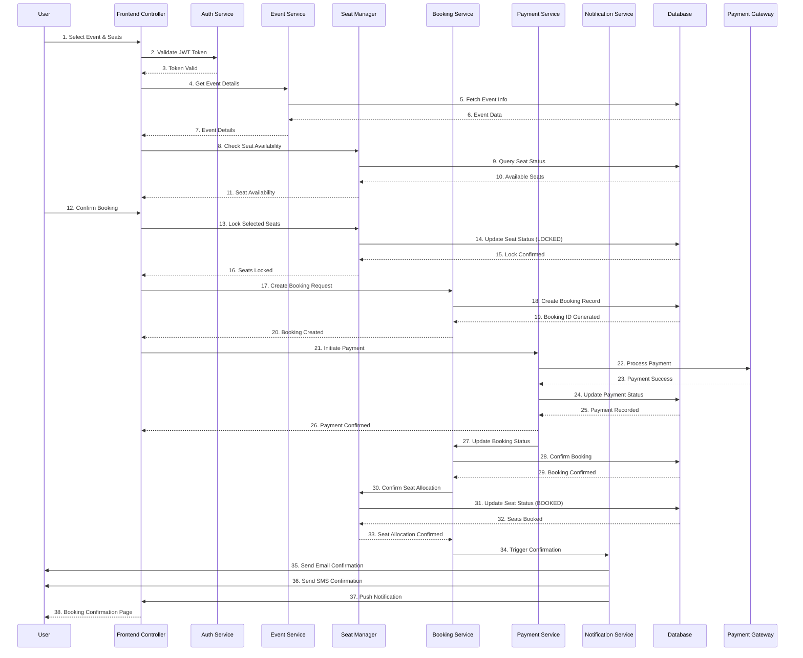
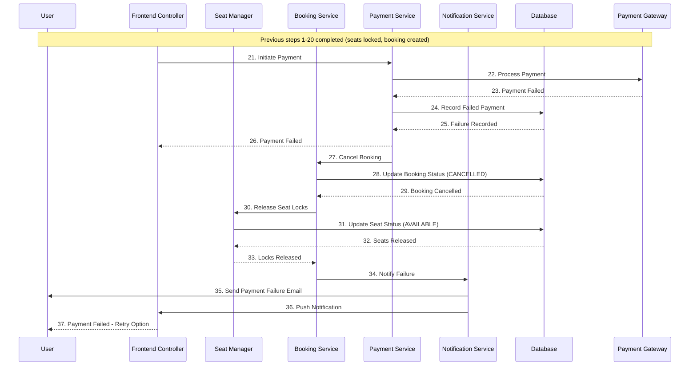
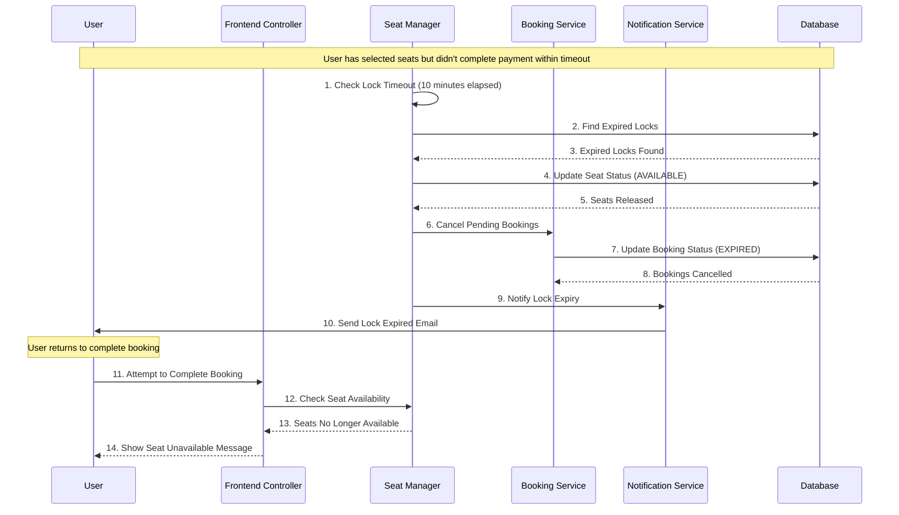
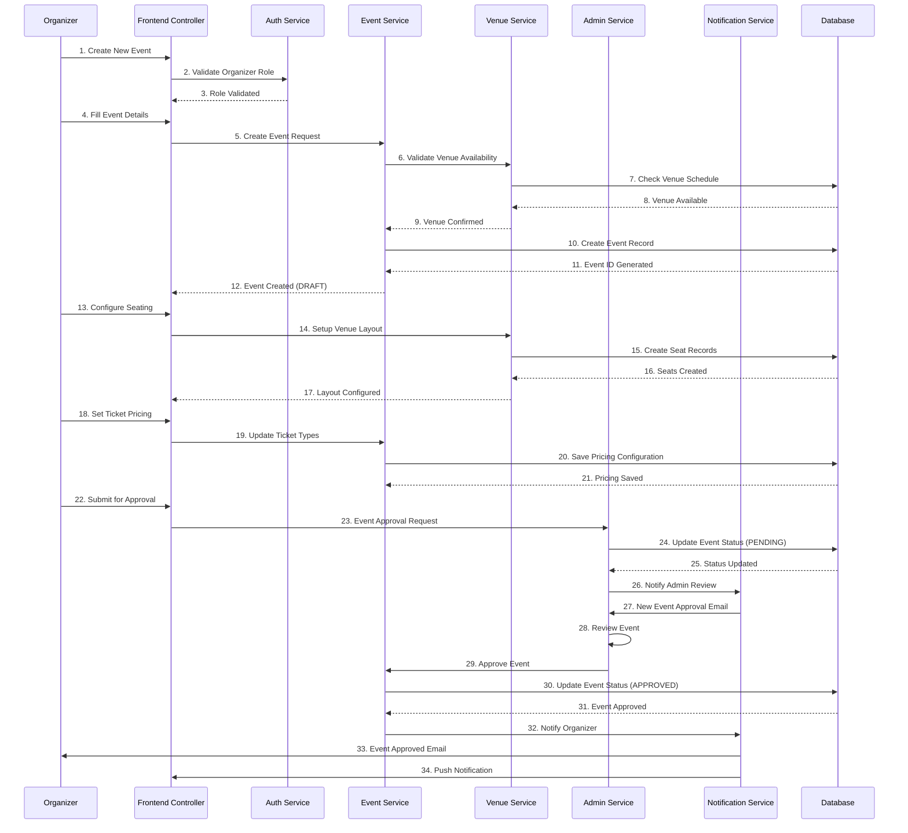
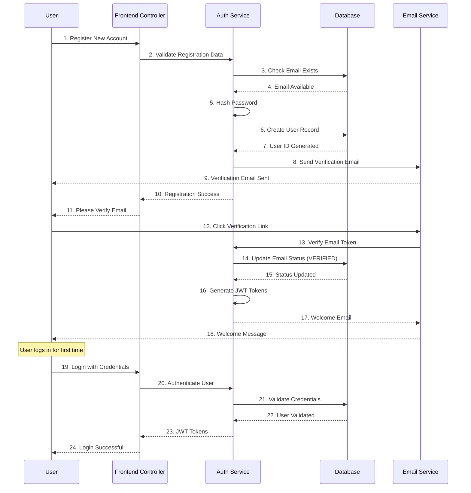

# Sequence Diagram — Eventify

## Overview

This sequence diagram illustrates the main end-to-end flow for booking a ticket in the Eventify platform, showing the interaction between the User, Frontend Controller, Backend Services, and external systems.

---

## Main Flow: Book Ticket (Success Path)

---

## Alternative Flow: Payment Failure

---

## Alternative Flow: Seat Lock Timeout

---

## Event Creation Flow

---

## User Registration Flow

---

## Key Design Patterns Demonstrated

### 1. **Mediator Pattern**
- The **Booking Service** acts as a mediator between Seat Manager, Payment Service, and Notification Service
- Coordinates complex booking workflow without tight coupling between services

### 2. **State Pattern**
- **Seat Status** transitions: AVAILABLE → LOCKED → BOOKED (or AVAILABLE on timeout)
- **Booking Status** transitions: PENDING → CONFIRMED → CANCELLED/EXPIRED

### 3. **Observer Pattern**
- **Notification Service** observes booking events and notifies multiple channels
- Payment status changes trigger notifications to multiple stakeholders

### 4. **Strategy Pattern**
- **Payment Service** uses different payment strategies (Credit Card, PayPal, etc.)
- Different notification strategies (Email, SMS, Push)

### 5. **Command Pattern**
- Booking actions (Create, Cancel, Confirm) are encapsulated as commands
- Enables undo/redo functionality and audit logging

---

## Error Handling and Resilience

### Timeout Mechanisms
- Seat locks automatically expire after 10 minutes
- Payment transactions timeout after 5 minutes
- Database connection pooling with retry logic

### Compensation Transactions
- Payment failure triggers automatic seat lock release
- Booking cancellation updates all related entities
- Failed email notifications are queued for retry

### Data Consistency
- Database transactions ensure atomicity across multiple tables
- Event sourcing for audit trail and recovery
- Optimistic locking prevents concurrent booking conflicts