```mermaid
graph TB
    subgraph Eventify Platform
        UC1["Register / Login"]
        UC2["Manage Profile"]
        UC3["Browse Events"]
        UC4["View Event Details"]
        UC5["Select Seats"]
        UC6["Book Ticket"]
        UC7["Process Payment"]
        UC8["View Booking History"]
        UC9["Cancel Booking"]
        UC10["Download Receipt"]
        UC11["Manage Notifications"]
        UC12["Create Event"]
        UC13["Configure Venue"]
        UC14["Set Ticket Pricing"]
        UC15["Manage Bookings"]
        UC16["View Analytics"]
        UC17["Generate Reports"]
        UC18["Manage Attendees"]
        UC19["Send Event Updates"]
        UC20["Manage Users"]
        UC21["Approve Events"]
        UC22["View System Analytics"]
        UC23["Manage Platform Settings"]
        UC24["View Audit Logs"]
        UC25["Generate System Reports"]
        UC26["Lock Seats"]
        UC27["Release Seat Locks"]
        UC28["Send Notifications"]
        UC29["Validate Payment"]
        UC30["Process Refund"]
    end

    Attendee((Attendee))
    Organizer((Organizer))
    Admin((Admin))
    PaymentGateway((Payment Gateway))

    %% Attendee use cases
    Attendee --> UC1
    Attendee --> UC2
    Attendee --> UC3
    Attendee --> UC4
    Attendee --> UC5
    Attendee --> UC6
    Attendee --> UC8
    Attendee --> UC9
    Attendee --> UC10
    Attendee --> UC11

    %% Organizer use cases
    Organizer --> UC1
    Organizer --> UC2
    Organizer --> UC12
    Organizer --> UC13
    Organizer --> UC14
    Organizer --> UC15
    Organizer --> UC16
    Organizer --> UC17
    Organizer --> UC18
    Organizer --> UC19
    Organizer --> UC11

    %% Admin use cases
    Admin --> UC1
    Admin --> UC20
    Admin --> UC21
    Admin --> UC22
    Admin --> UC23
    Admin --> UC24
    Admin --> UC25

    %% External Payment Gateway
    PaymentGateway --> UC29
    PaymentGateway --> UC30

    %% System-driven (internal) relationships
    UC6 -.->|triggers| UC26
    UC6 -.->|requires| UC7
    UC7 -.->|validates| UC29
    UC9 -.->|triggers| UC30
    UC9 -.->|releases| UC27
    UC12 -.->|requires| UC13
    UC12 -.->|requires| UC14
    UC19 -.->|uses| UC28
    UC26 -.->|timeout| UC27
    UC29 -.->|success| UC28
    UC29 -.->|failure| UC27
```

# Use Case Diagram — Eventify

## Overview

This diagram shows all major use cases for the Eventify platform, organized by the four primary actors: **Attendee**, **Organizer**, **Admin**, and **Payment Gateway** (external system).

---

---

## Use Case Descriptions

| # | Use Case | Actors | Description |
|---|----------|--------|-------------|
| UC1 | Register / Login | Attendee, Organizer, Admin | Create account or authenticate with JWT. Role assigned at registration. |
| UC2 | Manage Profile | Attendee, Organizer | Update personal information, preferences, and notification settings. |
| UC3 | Browse Events | Attendee | Search and filter events by category, date, location, and price. |
| UC4 | View Event Details | Attendee | View comprehensive event information including venue, seating map, and ticket types. |
| UC5 | Select Seats | Attendee | Interactive seat selection on venue seating map with real-time availability. |
| UC6 | Book Ticket | Attendee | Initiate booking process for selected seats and ticket types. |
| UC7 | Process Payment | Attendee | Complete payment using various payment methods (Credit Card, PayPal, etc.). |
| UC8 | View Booking History | Attendee | Access all past and current bookings with status and details. |
| UC9 | Cancel Booking | Attendee | Cancel existing bookings with refund processing according to cancellation policy. |
| UC10 | Download Receipt | Attendee | Download booking receipts and invoices for personal records. |
| UC11 | Manage Notifications | Attendee, Organizer | Configure notification preferences for email, SMS, and push notifications. |
| UC12 | Create Event | Organizer | Create new events with details, schedule, and basic configuration. |
| UC13 | Configure Venue | Organizer | Set up venue layout, seating arrangements, and capacity management. |
| UC14 | Set Ticket Pricing | Organizer | Define ticket categories, pricing tiers, and discount codes. |
| UC15 | Manage Bookings | Organizer | View, modify, and manage attendee bookings for their events. |
| UC16 | View Analytics | Organizer | Access real-time analytics for ticket sales, revenue, and attendance. |
| UC17 | Generate Reports | Organizer | Create detailed reports for financial and attendance analysis. |
| UC18 | Manage Attendees | Organizer | View attendee list, communicate with attendees, and manage special requests. |
| UC19 | Send Event Updates | Organizer | Send updates, announcements, and important information to attendees. |
| UC20 | Manage Users | Admin | Complete user administration including role management and account status. |
| UC21 | Approve Events | Admin | Review and approve events created by organizers before they go live. |
| UC22 | View System Analytics | Admin | Access platform-wide analytics including user growth and system performance. |
| UC23 | Manage Platform Settings | Admin | Configure system-wide settings, features, and platform policies. |
| UC24 | View Audit Logs | Admin | Monitor system activity and maintain security through audit trails. |
| UC25 | Generate System Reports | Admin | Create comprehensive reports for business intelligence and compliance. |
| UC26 | Lock Seats | System | Temporarily lock selected seats during booking process to prevent conflicts. |
| UC27 | Release Seat Locks | System | Release seat locks when booking is completed, cancelled, or times out. |
| UC28 | Send Notifications | System | Automated notification system for booking confirmations and updates. |
| UC29 | Validate Payment | Payment Gateway | External payment gateway validates and processes payment transactions. |
| UC30 | Process Refund | Payment Gateway | External payment gateway handles refund processing for cancelled bookings. |

---

## Actor Relationships

### Primary Actors

**Attendee**: End users who browse events and book tickets
- Can register/login and manage their profile
- Browse and search for events
- Select seats and complete bookings
- Manage their bookings and receive notifications

**Organizer**: Event creators who manage events and venues
- Inherits all Attendee capabilities
- Can create and manage events
- Configure venues and pricing
- View analytics and manage attendees
- Communicate with event participants

**Admin**: System administrators with full platform access
- Manages all users and their roles
- Approves events and monitors platform health
- Accesses comprehensive analytics and reports
- Configures system settings and policies

### External System

**Payment Gateway**: Third-party payment processing service
- Validates payment information
- Processes transactions securely
- Handles refunds and chargebacks
- Provides payment status updates

---

## Use Case Prioritization

### High Priority (MVP)
- UC1: Register / Login
- UC3: Browse Events
- UC4: View Event Details
- UC5: Select Seats
- UC6: Book Ticket
- UC7: Process Payment
- UC12: Create Event
- UC13: Configure Venue
- UC14: Set Ticket Pricing

### Medium Priority (Phase 2)
- UC8: View Booking History
- UC9: Cancel Booking
- UC11: Manage Notifications
- UC15: Manage Bookings
- UC16: View Analytics
- UC20: Manage Users

### Low Priority (Phase 3)
- UC10: Download Receipt
- UC17: Generate Reports
- UC18: Manage Attendees
- UC19: Send Event Updates
- UC21: Approve Events
- UC22-25: Admin analytics and reporting